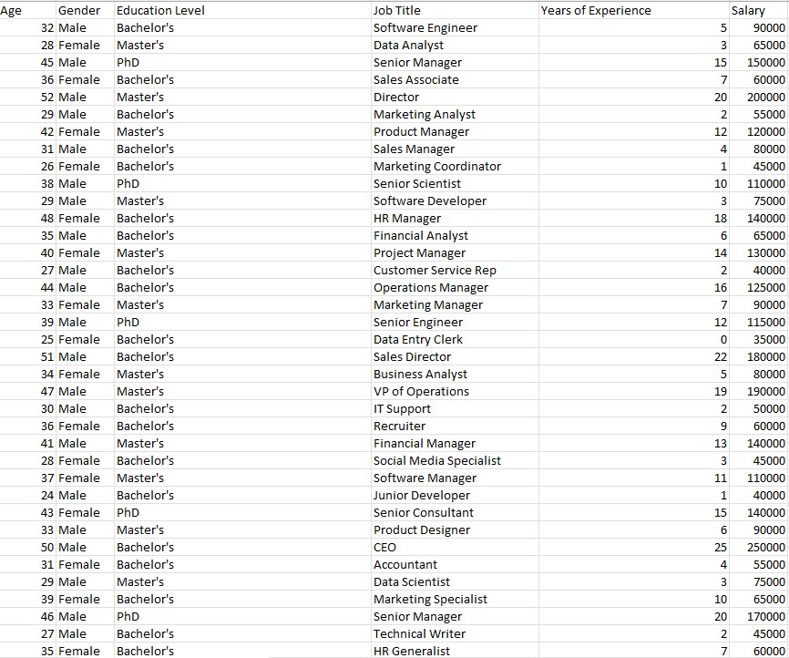
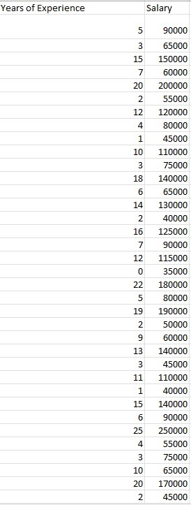
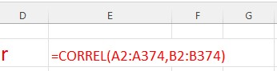
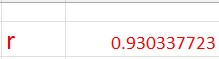

# Salary-Prediction-Uisng-Excel

# Introduction

This data was gotten from Kaggle and the analysis was carried out using Microsoft Excel to predict employee salary using different variables. 

# Problem Statement 

The aim of this analysis is to build a model & answer the question of a sales company if years of experience has an effect on the salary of employees.

# Skills & Concept used:

- Statistics
- Equation of a straight line
- Linear Regression
- Coefficient of Correlation (Measures the degree of relationship between 2 variables)
- Coefficient of Determination (explains how good your model is ie it explains how the difference in one variable can be explained by the difference in the second/other variable )
- Data Science
- Data Analysis
- Data Transformation
- Data Visualization & Design (Using appropriate visuals to send appropriate message to stakeholders)

# Data Source:

A simple Csv file was downloaded from kaggle.com.

# Data Transformation/Cleaning:

I carried out transformation by removing blanks from the data so as not to affect my final linear regression model. The image below shows the that after transformation

# Linear Regression

A new sheet was created that contains only the predictor variable and target variable data as shown below.

r was calculated using excel function to ascertain if there is a relation between the 2 variables using the formula shown below.

The result for r is shown in the image below: 

r = 0.93033 simply means there is a strong positive relationship of about 93% between the target and predictor variable.
