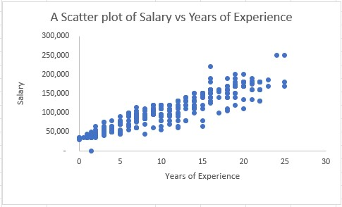
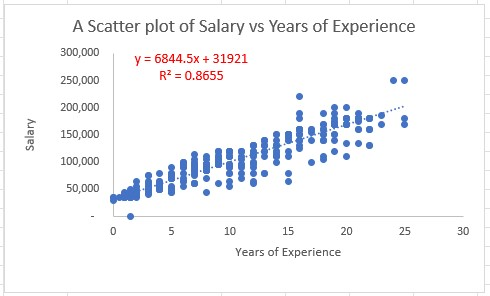
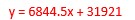
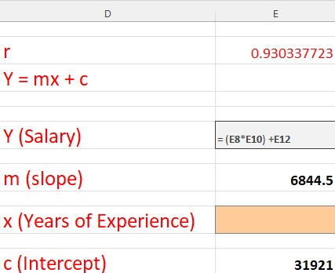
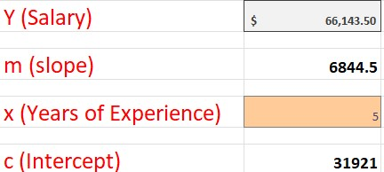
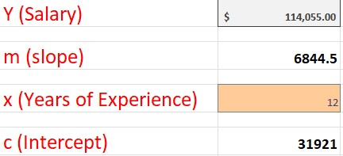

# Salary-Prediction-Uisng-Excel

# Introduction

This data was gotten from Kaggle and the analysis was carried out using Microsoft Excel to predict employee salary using different variables. 

# Problem Statement 

The aim of this analysis is to build a model & answer the question of a sales company if years of experience has an effect on the salary of employees.

# Skills & Concept used:

- Statistics
- Equation of a straight line
- Linear Regression
- Coefficient of Correlation (Measures the degree of relationship between 2 variables)
- Coefficient of Determination (explains how good your model is ie it explains how the difference in one variable can be explained by the difference in the second/other variable )
- Data Science
- Data Analysis
- Data Transformation
- Data Visualization & Design (Using appropriate visuals to send appropriate message to stakeholders)

# Data Source:

A simple Csv file was downloaded from kaggle.com.

# Data Transformation/Cleaning:

I carried out transformation by removing blanks from the data so as not to affect my final linear regression model. The image below shows the that after transformation

# Linear Regression

A new sheet was created that contains only the predictor variable and target variable data as shown below.

r was calculated using excel function to ascertain if there is a relation between the 2 variables using the formula shown below.

The result for r is shown in the image below: 

r = 0.93033 simply means there is a strong positive relationship of about 93% between the target and predictor variable.

# Data Visualization

A scatter plot was plotted between the 2 variables to ascertain the relationship. The plot is shown in the image below.

Next a line of best fit was added to the scatter plot to ascertain the model and value for r square(r^2) as shown below.

r^2 = 0.8655 means the model 86.55% accurate . It simply tells us how strong our model is.

From the scatter plot, the linear regression model which is similar to the equation of a straight line y = mx + c is shown in the image below.

Now that we have the model as shown above, the model was defined in different cells in excel as shown below.

The model was then tested using different years of experience. An experience of 5years was put in the model and the result is shown below.

Another test was carried out using an experience of 12 years and the result was shown below.

# Conclusion

- Strong Relationship: The high R-value of 0.93 indicates a strong positive correlation between years of experience and salary. This means that as the years of experience increase, the salary tends to increase as well.

- Good Fit: The R-squared value of 0.8655 suggests that approximately 86.55% of the variation in salary can be explained by the linear relationship with years of experience. This indicates that the model is a good fit for predicting salaries based on years of experience.

- Predictive Power: With a high R-value and a good fit indicated by the R-squared value, the model can be used to make reasonably accurate predictions of salary based on a person's years of experience.

- Importance of Experience: The model highlights the importance of years of experience in determining salary. It suggests that as employees gain more experience, they can expect their salaries to increase accordingly. 

# Recommendation

 - It is important to note that the linear regression model assumes a linear relationship between years of experience and salary. Other factors not included in the model, such as education, job performance, or industry-specific factors, may also impact salaries. Therefore, while the model provides a useful starting point, it should not be considered as the sole determinant of salary decisions.
